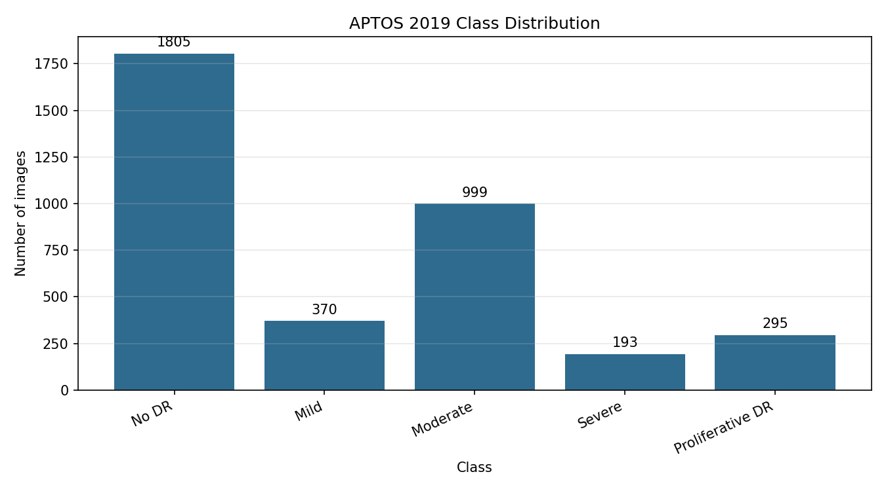
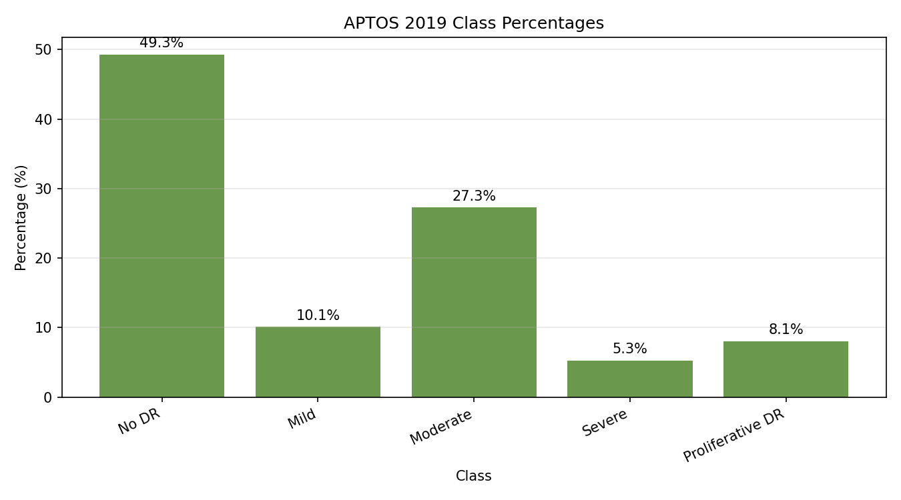
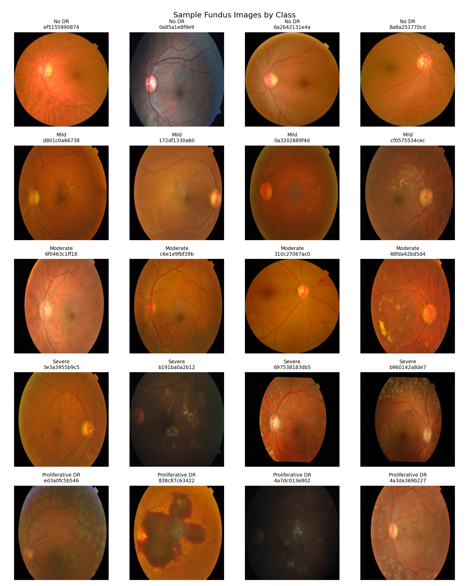
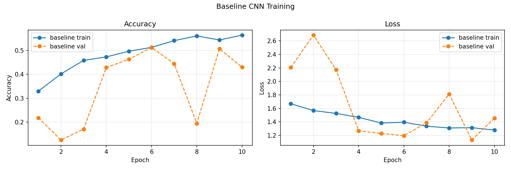
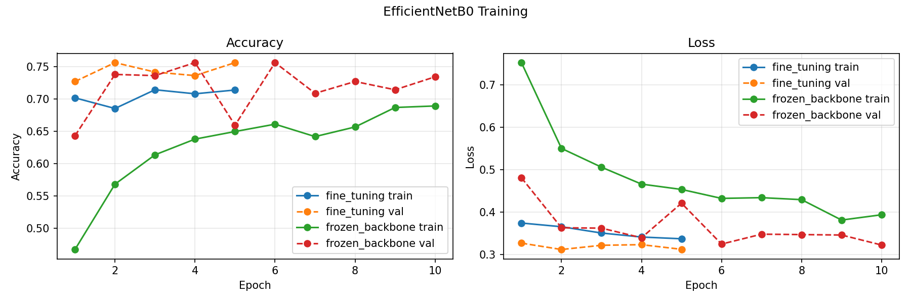
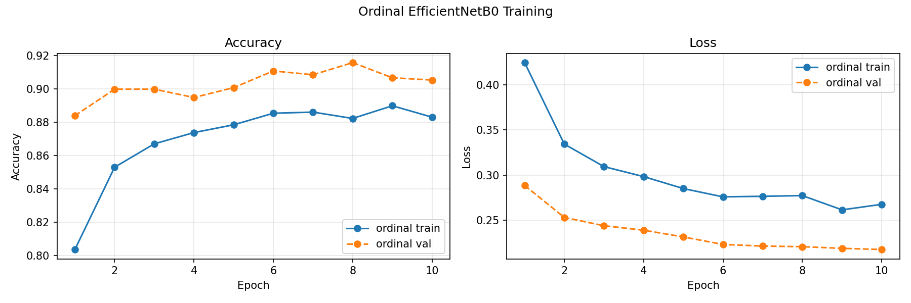
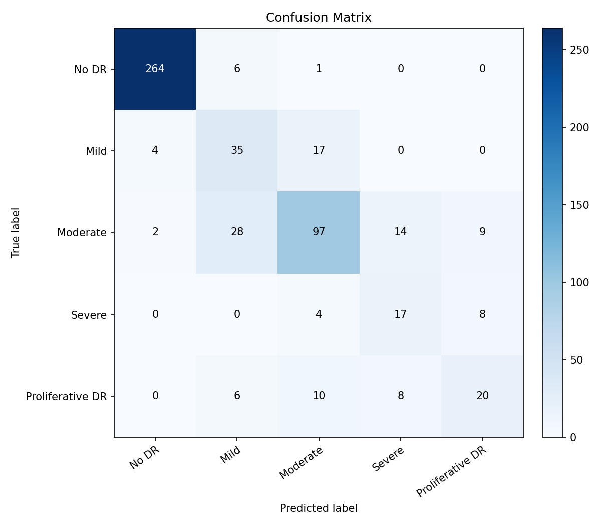
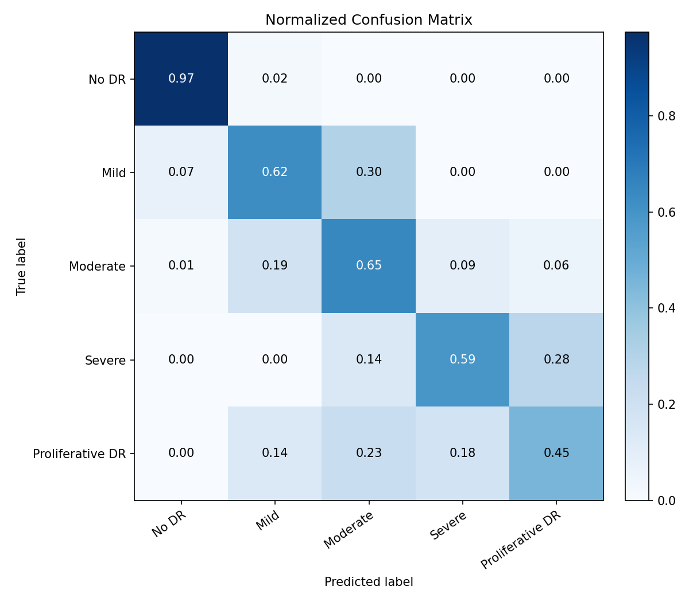
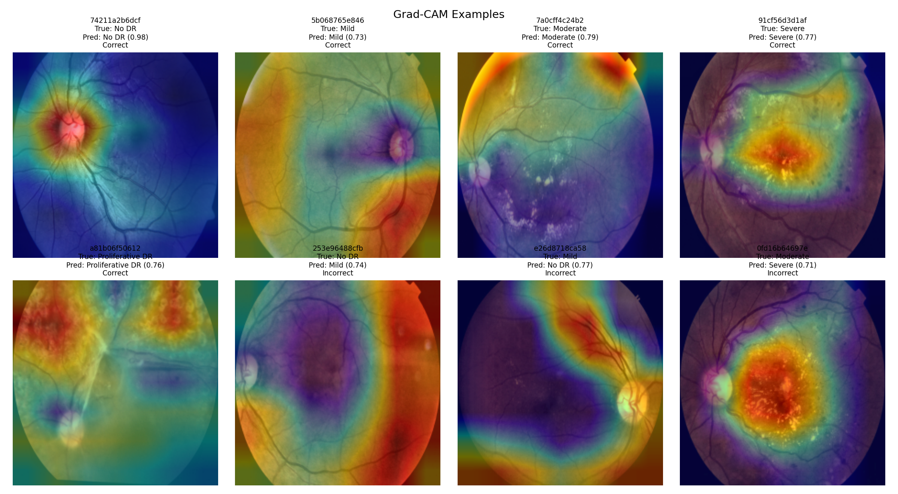

# Lightweight Deep Learning and Explainable AI for Diabetic Retinopathy Grading Using APTOS 2019 Fundus Images

Universiteti

Lënda: Metodologji e kërkimit / Research Methodology

Tema: Diabetic Retinopathy Grading me Deep Learning të lehtë dhe Explainable AI

---

## Përmbajtja

1. [Përmbledhje e projektit](#përmbledhje-e-projektit)
2. [Qëllimi i punimit](#qëllimi-i-punimit)
3. [Çka shton ky projekt?](#çka-shton-ky-projekt)
4. [Dataset-i](#dataset-i)
5. [Struktura e repository-t](#struktura-e-repository-t)
6. [Instalimi](#instalimi)
7. [Shkarkimi i dataset-it](#shkarkimi-i-dataset-it)
8. [Ekzekutimi i pipeline-it](#ekzekutimi-i-pipeline-it)
9. [Përshkrimi i skripteve](#përshkrimi-i-skripteve)
10. [Metodologjia eksperimentale](#metodologjia-eksperimentale)
11. [Rezultatet finale](#rezultatet-finale)
12. [Interpretimi i rezultateve](#interpretimi-i-rezultateve)
13. [Grad-CAM dhe Explainable AI](#grad-cam-dhe-explainable-ai)
14. [Vizualizimet e gjeneruara](#vizualizimet-e-gjeneruara)
15. [Output-et kryesore](#output-et-kryesore)
16. [Kufizimet](#kufizimet)
17. [Përmirësime të ardhshme](#përmirësime-të-ardhshme)
18. [Zgjidhja e problemeve](#zgjidhja-e-problemeve)

---

## Përmbledhje e projektit

Ky projekt ndërton një pipeline të plotë, modular dhe të riprodhueshëm për klasifikimin e retinopatisë diabetike nga imazhet fundus të dataset-it **APTOS 2019 Blindness Detection**.

Objektivi i projektit nuk është zhvillimi i një sistemi klinik final, por ndërtimi i një pipeline-i akademik, të riprodhueshëm dhe të shpjegueshëm, i cili mund të ekzekutohet në një mjedis kompjuterik me burime të kufizuara, për shembull me rreth 16GB RAM.

Projekti përfshin:

- kontroll të dataset-it;
- exploratory data analysis;
- preprocessing specifik për fundus images;
- train/validation/test split me stratification;
- baseline CNN;
- EfficientNetB0 me transfer learning;
- fine-tuning të kontrolluar;
- trajtim të class imbalance;
- formulim ordinal;
- cross-validation të përshtatur për burime kompjuterike të kufizuara;
- vlerësim me metrika të plota;
- Grad-CAM për Explainable AI;
- dokumente akademike për metodologji dhe rezultate.

---

## Qëllimi i punimit

Qëllimi kryesor është të analizohet se sa mirë mund të ndërtohet një pipeline i lehtë deep learning për diabetic retinopathy grading duke krahasuar:

1. një model të thjeshtë baseline CNN;
2. një model EfficientNetB0 me transfer learning;
3. një variant ordinal të EfficientNetB0;
4. interpretueshmërinë e modelit më të mirë me Grad-CAM.

Objektivat kryesore janë:

- të trajtohet pabarazia e klasave;
- të analizohet performanca në klasat e vështira si `Mild`, `Severe` dhe `Proliferative DR`;
- të përdoren metrika më të përshtatshme se accuracy, si macro F1 dhe Quadratic Weighted Kappa;
- të testohet stabiliteti me cross-validation;
- të krijohen figura dhe metrika të gatshme për raport universitar.

---

## Çka shton ky projekt?

Ky projekt nuk synon të prezantojë një arkitekturë të re klinike. Vlera e tij është metodologjike.

Ai shton një pipeline të plotë dhe të shpjegueshëm që kombinon:

- **fundus-specific preprocessing** me black-border cropping dhe CLAHE;
- **class imbalance handling** me class weights, balanced sampling dhe focal loss;
- **transfer learning** me EfficientNetB0;
- **fine-tuning** të lehtë dhe të kontrolluar;
- **ordinal formulation**, sepse klasat 0-4 kanë renditje natyrore;
- **cross-validation** për të mos u mbështetur vetëm në një split;
- **Grad-CAM** për interpretueshmëri vizuale;
- **raportim akademik** me tabela, metrika, figura dhe dokumente Markdown.

Kjo është e rëndësishme sepse shumë punime raportojnë vetëm accuracy në një dataset të vetëm. Ky projekt e zgjeron analizën me stabilitet, imbalance, gabime për klasë dhe interpretueshmëri.

---

## Dataset-i

Dataset-i i përdorur është:

```text
APTOS 2019 Blindness Detection
```

Struktura e pritur:

```text
data/raw/aptos2019/
    train.csv
    test.csv
    sample_submission.csv
    train_images/
    test_images/
```

Në këtë projekt përdoren vetëm:

```text
data/raw/aptos2019/train.csv
data/raw/aptos2019/train_images/
```

Arsyeja është se `test_images/` nga Kaggle nuk ka etiketa publike. Prandaj `train.csv` ndahet në train, validation dhe test.

Klasat:

| Label | Klasa |
|---:|---|
| 0 | No DR |
| 1 | Mild |
| 2 | Moderate |
| 3 | Severe |
| 4 | Proliferative DR |

Dataset-i final i përdorur në eksperimente:

```text
Numri total i imazheve të etiketuara: 3662
Numri i imazheve të gjetura lokalisht: 3662
Numri i imazheve që mungojnë: 0
```

---

## Struktura e repository-t

```text
DiabeticRetinopathy_XAI/
│
├── data/
│   ├── raw/
│   │   └── aptos2019/
│   │       ├── train.csv
│   │       ├── test.csv
│   │       ├── sample_submission.csv
│   │       ├── train_images/
│   │       └── test_images/
│   ├── processed/
│   │   ├── fundus_224/
│   │   ├── train_available.csv
│   │   └── train_preprocessed.csv
│   └── splits/
│       ├── train_split.csv
│       ├── val_split.csv
│       └── test_split.csv
│
├── notebooks/
│
├── src/
│   ├── __init__.py
│   ├── config.py
│   ├── 00_download_dataset.py
│   ├── 01_check_dataset.py
│   ├── 02_eda.py
│   ├── 03_create_splits.py
│   ├── 04_train_baseline_cnn.py
│   ├── 05_train_efficientnet.py
│   ├── 06_evaluate_model.py
│   ├── 07_gradcam_xai.py
│   ├── 08_preprocess_fundus_images.py
│   ├── 09_train_ordinal_efficientnet.py
│   ├── 10_cross_validation.py
│   └── utils/
│       ├── __init__.py
│       ├── data_utils.py
│       ├── image_utils.py
│       ├── model_utils.py
│       ├── metrics_utils.py
│       └── gradcam_utils.py
│
├── models/
│   ├── baseline_cnn.keras
│   ├── efficientnetb0_best.keras
│   ├── efficientnetb0_final.keras
│   └── ordinal_efficientnetb0.keras
│
├── outputs/
│   ├── figures/
│   ├── metrics/
│   ├── gradcam/
│   └── logs/
│
├── reports/
│   ├── methodology_text.md
│   └── results_summary.md
│
├── requirements.txt
├── README.md
└── .gitignore
```

---

## Instalimi

Nga root folder-i i projektit:

```powershell
cd DiabeticRetinopathy_XAI
python -m venv .venv
.\.venv\Scripts\activate
python -m pip install --upgrade pip
pip install -r requirements.txt
```

Pakot kryesore:

```text
tensorflow
numpy
pandas
matplotlib
scikit-learn
opencv-python
pillow
tqdm
```

Rekomandim:

```text
Python 3.10, 3.11 ose 3.12
RAM: 16GB
GPU: opsionale
```

Në Windows me TensorFlow >= 2.11, TensorFlow zakonisht ekzekutohet në procesor në instalime standarde. Për këtë arsye, konfigurimi i eksperimenteve është mbajtur konservativ.

---

## Shkarkimi i dataset-it

Nëse dataset-i mungon, mund të përdoret:

```powershell
python src/00_download_dataset.py --source huggingface
```

Ky skript provon të marrë të dhënat e nevojshme për projektin. Në këtë punë, ai u përdor për të marrë 306 imazhet që mungonin.

Nëse dëshiron Kaggle CLI:

```powershell
pip install kaggle
New-Item -ItemType Directory -Force -Path "$env:USERPROFILE\.kaggle"
Copy-Item .\kaggle.json "$env:USERPROFILE\.kaggle\kaggle.json"
kaggle competitions download -c aptos2019-blindness-detection -p data/raw/aptos2019
Expand-Archive data/raw/aptos2019/aptos2019-blindness-detection.zip -DestinationPath data/raw/aptos2019 -Force
```

Nëse dataset-i është tashmë lokal, mos e ekzekuto shkarkimin përsëri.

---

## Ekzekutimi i pipeline-it

Rendi i plotë i përdorur për rezultatet finale:

```powershell
python src/01_check_dataset.py
python src/02_eda.py --dimension-sample 500
python src/08_preprocess_fundus_images.py
python src/03_create_splits.py
```

Trajnimi i baseline CNN:

```powershell
python src/04_train_baseline_cnn.py --epochs 10 --batch-size 16
python src/06_evaluate_model.py --model-name baseline --batch-size 16 --output-prefix baseline_full
```

Trajnimi i EfficientNetB0 të përmirësuar:

```powershell
python src/05_train_efficientnet.py --epochs 10 --batch-size 8 --fine-tune --fine-tune-epochs 5 --fine-tune-layers 20 --balanced-sampling --focal-loss --patience 4
python src/06_evaluate_model.py --model-name efficientnet --batch-size 8 --output-prefix efficientnet_enhanced
```

Trajnimi i modelit ordinal:

```powershell
python src/09_train_ordinal_efficientnet.py --epochs 10 --batch-size 8 --balanced-sampling --patience 4
```

Cross-validation:

```powershell
python src/10_cross_validation.py --folds 3 --batch-size 8
```

Grad-CAM:

```powershell
python src/07_gradcam_xai.py --num-cases 8 --predictions-csv outputs/metrics/predictions_efficientnet_enhanced.csv
```

---

## Përshkrimi i skripteve

`00_download_dataset.py` përdoret vetëm kur dataset-i mungon ose kur disa imazhe nuk janë shkarkuar. Ai mund të përdorë Kaggle CLI ose burim alternativ publik.

`01_check_dataset.py` kontrollon `train.csv`, kolonat, shpërndarjen e klasave, ekzistencën e imazheve dhe ruan përmbledhje në `outputs/metrics/dataset_check_summary.csv`.

`02_eda.py` krijon grafikë për class distribution, përqindjet dhe shembuj imazhesh sipas klasës. Gjithashtu llogarit statistika bazike të dimensioneve.

`03_create_splits.py` krijon train, validation dhe test split me stratification dhe `random_state=42`.

`04_train_baseline_cnn.py` trajnon një CNN të thjeshtë me class weights, EarlyStopping, ModelCheckpoint dhe ReduceLROnPlateau.

`05_train_efficientnet.py` trajnon EfficientNetB0 me transfer learning. Skripti mbështet fine-tuning, balanced sampling dhe focal loss.

`06_evaluate_model.py` vlerëson modelin, ruan predictions, classification report, confusion matrix, normalized confusion matrix dhe metrics JSON.

`07_gradcam_xai.py` gjeneron Grad-CAM heatmaps për raste të sakta dhe të gabuara.

`08_preprocess_fundus_images.py` krijon versionet e përpunuara të imazheve fundus në `data/processed/fundus_224/`.

`09_train_ordinal_efficientnet.py` trajnon modelin ordinal me katër pragje kumulative.

`10_cross_validation.py` ekzekuton cross-validation të lehtë me EfficientNetB0 features dhe Logistic Regression të balancuar.

---

## Metodologjia eksperimentale

Pipeline-i ndjek këto faza:

1. Kontrolli i dataset-it dhe verifikimi i imazheve.
2. EDA për shpërndarjen e klasave dhe shembuj vizualë.
3. Preprocessing fundus me crop, CLAHE dhe resize 224x224.
4. Stratified train/validation/test split.
5. Trajnim i baseline CNN.
6. Trajnim i EfficientNetB0 me transfer learning.
7. Fine-tuning i kontrolluar.
8. Trajtim i imbalance me class weights, balanced sampling dhe focal loss.
9. Testim i formulimit ordinal.
10. Cross-validation për stabilitet.
11. Grad-CAM për interpretueshmëri.

---

## Rezultatet finale

| Modeli | Accuracy | Macro Precision | Macro Recall | Macro F1 | Weighted F1 | QWK | ROC-AUC macro |
|---|---:|---:|---:|---:|---:|---:|---:|
| Baseline CNN | 0.5418 | 0.3660 | 0.4491 | 0.3497 | 0.5227 | 0.5951 | 0.8407 |
| EfficientNetB0 enhanced | 0.7873 | 0.6346 | 0.6573 | 0.6399 | 0.7908 | 0.8723 | 0.9272 |
| Ordinal EfficientNetB0 | 0.7418 | 0.5889 | 0.5924 | 0.5553 | 0.7394 | 0.8540 | Nuk aplikohet |

Modeli më i mirë është **EfficientNetB0 enhanced**.

Përmirësimi kryesor ndaj baseline:

```text
Accuracy: 0.5418 -> 0.7873
Macro F1: 0.3497 -> 0.6399
QWK: 0.5951 -> 0.8723
```

Cross-validation me 3 folds:

```text
Accuracy mean: 0.7889
Accuracy std: 0.0067
Macro F1 mean: 0.6206
Macro F1 std: 0.0057
QWK mean: 0.8532
QWK std: 0.0170
```

Këto rezultate tregojnë se performanca është relativisht stabile, jo thjesht rezultat i një split-i të vetëm.

---

## Interpretimi i rezultateve

Rezultatet janë të përshtatshme për një projekt akademik me konfigurim kompjuterik konservativ. EfficientNetB0 enhanced arrin performancë dukshëm më të mirë se baseline CNN, sidomos në macro F1 dhe QWK.

Megjithatë, klasat minoritare mbeten sfiduese:

- `Mild` shpesh ngatërrohet me `Moderate`;
- `Moderate` ngatërrohet me stadet fqinje;
- `Severe` dhe `Proliferative DR` kanë pak shembuj, prandaj janë më të vështira për t'u mësuar.

Kjo është në përputhje me motivimin kërkimor të projektit: diabetic retinopathy grading është problem i pabalancuar, ordinal dhe vizualisht i vështirë.

---

## Grad-CAM dhe Explainable AI

Grad-CAM u aplikua mbi modelin më të mirë, EfficientNetB0 enhanced.

Output-et:

```text
outputs/gradcam/
outputs/figures/gradcam_examples.png
outputs/metrics/gradcam_selected_cases.csv
```

Skripti zgjodhi:

```text
5 raste të klasifikuara saktë
3 raste të klasifikuara gabim
```

Grad-CAM ndihmon për të diskutuar nëse modeli fokusohet në zona relevante të retinës. Kjo adreson mungesën e transparencës së modeleve deep learning dhe shton komponentën e Explainable AI në punim.

---

## Vizualizimet e gjeneruara

Kjo pjesë paraqet figurat kryesore të gjeneruara nga pipeline-i eksperimental. Figurat janë kopjuar në `reports/figures/` në mënyrë që të jenë të dukshme edhe në repository.

### Shpërndarja e klasave

Figura e mëposhtme tregon shpërndarjen absolute të klasave në APTOS 2019. Ajo e bën të dukshme dominimin e klasës `No DR` dhe numrin më të vogël të rasteve në klasën `Severe`.



Figura me përqindje e paraqet të njëjtin problem në formë relative. Kjo është e rëndësishme për të arsyetuar përdorimin e macro metrics dhe teknikave për trajtimin e class imbalance.



### Shembuj imazhesh sipas klasës

Kjo figurë paraqet shembuj të imazheve fundus nga secila klasë. Ajo përdoret për të kuptuar variacionin vizual të dataset-it dhe vështirësinë e dallimit midis stadeve fqinje.



### Curves të trajnimit

Grafikët e trajnimit tregojnë ndryshimin e loss dhe accuracy gjatë epochs. Këto figura ndihmojnë për të analizuar nëse modeli po mëson në mënyrë stabile dhe nëse ka shenja të overfitting.







### Confusion matrix

Confusion matrix e modelit EfficientNetB0 enhanced tregon gabimet kryesore midis klasave. Gabimet më të shpeshta ndodhin midis klasave fqinje, veçanërisht `Mild`, `Moderate`, `Severe` dhe `Proliferative DR`.



Versioni i normalizuar lehtëson krahasimin midis klasave me numër të ndryshëm mostrash.



### Grad-CAM

Grad-CAM paraqet zonat që ndikuan në parashikimin e modelit. Figura përfshin raste të klasifikuara saktë dhe gabim, në mënyrë që interpretimi të mos kufizohet vetëm në shembuj pozitivë.



---

## Output-et kryesore

Figura:

```text
outputs/figures/class_distribution.png
outputs/figures/class_distribution_percent.png
outputs/figures/sample_images_by_class.png
outputs/figures/baseline_cnn_training_curves.png
outputs/figures/efficientnetb0_training_curves.png
outputs/figures/ordinal_efficientnetb0_training_curves.png
outputs/figures/confusion_matrix_baseline_full.png
outputs/figures/confusion_matrix_efficientnet_enhanced.png
outputs/figures/confusion_matrix_normalized_efficientnet_enhanced.png
outputs/figures/gradcam_examples.png
```

Metrika:

```text
outputs/metrics/dataset_check_summary.csv
outputs/metrics/eda_summary.csv
outputs/metrics/split_summary.csv
outputs/metrics/model_comparison_summary.csv
outputs/metrics/evaluation_metrics_baseline_full.json
outputs/metrics/evaluation_metrics_efficientnet_enhanced.json
outputs/metrics/evaluation_metrics_ordinal_efficientnet.json
outputs/metrics/classification_report_efficientnet_enhanced.csv
outputs/metrics/cross_validation_efficientnet_features_summary.json
outputs/metrics/gradcam_selected_cases.csv
```

Modele:

```text
models/baseline_cnn.keras
models/efficientnetb0_best.keras
models/efficientnetb0_final.keras
models/ordinal_efficientnetb0.keras
```

Raporte:

```text
reports/methodology_text.md
reports/results_summary.md
```

---

## Kufizimet

Kufizimet kryesore:

- eksperimenti përdor vetëm APTOS 2019 dhe nuk teston generalizim në dataset tjetër;
- trajnimi u krye në konfigurim kompjuterik konservativ;
- imazhet u standardizuan në 224x224, që mund të humbasë detaje të vogla;
- klasat `Severe` dhe `Proliferative DR` kanë pak shembuj;
- Grad-CAM është interpretim vizual ndihmës, jo validim klinik;
- cross-validation është bërë me frozen features për të ulur koston kompjuterike, jo me trajnim të plotë deep learning në çdo fold.

---

## Përmirësime të ardhshme

Puna mund të zgjerohet me:

- validim në dataset të jashtëm, si Messidor ose EyePACS;
- rezolucion më të lartë nëse përdoret GPU;
- tuning të focal loss me alpha për klasat;
- ensemble midis EfficientNetB0 softmax dhe modelit ordinal;
- testim të preprocessing variants;
- calibration të probabiliteteve;
- analizë manuale të Grad-CAM nga ekspert klinik;
- deep learning k-fold të plotë në një makinë më të fuqishme.

---

## Zgjidhja e problemeve

Nëse dataset-i nuk gjendet:

```powershell
python src/00_download_dataset.py --source huggingface
python src/01_check_dataset.py
```

Nëse trajnimi është shumë i ngadalshëm:

```powershell
python src/05_train_efficientnet.py --epochs 5 --batch-size 8
```

Nëse memoria nuk mjafton:

```powershell
python src/05_train_efficientnet.py --batch-size 4
```

Nëse EfficientNet nuk shkarkon ImageNet weights:

```powershell
python src/05_train_efficientnet.py --weights none
```

Nëse Grad-CAM nuk gjen layer:

```powershell
python src/07_gradcam_xai.py --layer-name top_conv
```

Nëse PowerShell shfaq karaktere të çuditshme për tekstin shqip, file-t janë ende UTF-8. Hapini në VS Code ose në editor me UTF-8 encoding.

---

## Përfundim

Ky projekt realizon një pipeline të plotë për diabetic retinopathy grading me APTOS 2019, duke krahasuar baseline CNN, EfficientNetB0 të përmirësuar, formulim ordinal dhe cross-validation. Rezultatet tregojnë se EfficientNetB0 enhanced është modeli më i mirë në këtë konfigurim, me accuracy 78.7%, macro F1 64.0% dhe QWK 0.8723.

Pika më e fortë e projektit është kombinimi i performancës numerike me interpretueshmëri, stabilitet dhe analizë të class imbalance. Kjo e bën projektin të përshtatshëm për një punim universitar ku kërkohet jo vetëm implementim, por edhe arsyetim metodologjik.
